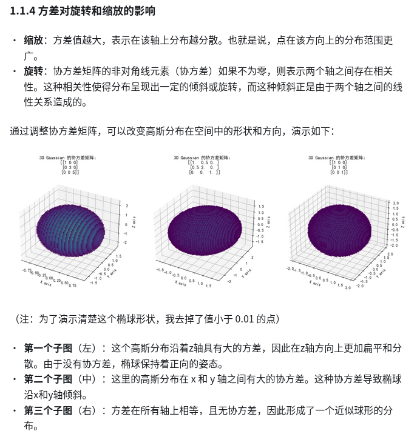

## 基础知识

### 一、空间的表达形式
- 传统mesh：是纯离散，显式表达在三维空间内。它由一系列三角形或多边形面片构成，通过顶点连接，顶点包含三维坐标信息，能直观展示物体几何形态。在计算机图形学领域应用广泛，可利用图形硬件加速实现逼真绘制，但处理大规模场景或频繁变形物体时存在数据量大、存储传输成本高以及处理复杂拓扑结构繁琐等问题。
- 体素（Voxel）：是三维空间中的像素，将三维空间划分为均匀的小立方体单元，每个体素包含物体的属性信息，如密度、颜色等。体素模型是一种体数据结构，常用于医学影像处理、三维重建等领域。优点是对复杂形状的表达较为简单，便于进行空间分析和计算；缺点是数据量巨大，存储和处理成本高，且模型的细节表现受体素分辨率限制。
- 点云（Point Cloud）：由大量离散的点组成，每个点包含三维坐标信息，还可能包含颜色、法线等额外属性。点云通常通过三维扫描设备获取，广泛应用于自动驾驶、逆向工程、地理信息系统等领域。其优势在于数据采集方便快捷，能快速获取物体表面的大量信息；缺点是缺乏拓扑结构，难以直接用于渲染和建模，需要进行后续处理来构建表面模型。
- NERF： 纯连续的，隐式表达在可微空间内；
- 3DGS： 是在离散和连续之间的一个平衡，在一个高斯椭球内部是连续的、可微的；而在整个空间，每个高斯体又是离散的。

### 二、3DGS的动机
- 传统的 3D 模型表示方法，如 离散的Mesh 和点云，以及连续的 Nerf，通常面临着一个主要问题：随机采样过程中产生的噪声，这直接影响了渲染质量。此外，这些方法在渲染速度和渲染质量之间不可兼得。为了解决这一问题，论文提出了3D Gaussian Splatting（3DGS）。这种技术通过结合离散和连续表示方法的优势，不仅克服了传统方法在噪声和渲染质量方面的限制，而且极大地提高了渲染速度。
- 引入3D gaussian作为 3D 表示，高效，准确，无结构 。3D gaussian的优化算法：Clone 和 剪枝。 快速可微渲染器。

### 三、方法
1. 3D高斯参数化
协方差矩阵的物理意义：

特征值决定椭球轴长（几何尺度）

特征向量决定椭球方向（各向异性）

实际存储：转换为旋转矩阵（R）和缩放矩阵（S），即 Σ = R·S·Sᵀ·Rᵀ，减少参数冗余。

2. 可微渲染管线
步骤：

视锥剔除：仅保留相机视锥内的可见高斯核。

图块划分：将屏幕划分为16×16像素块，分配覆盖该块的高斯核。

深度排序：对每个图块内的高斯核按深度排序（近似O(n)复杂度）。

Alpha混合：从后向前混合高斯核的颜色（类似体积渲染方程，但解析计算）。

可微性：渲染结果的梯度可反向传播至高斯参数（位置、协方差、透明度等）。

3. 动态优化策略
自适应密度控制：

克隆（Clone）：对高梯度区域（如边缘）增加高斯核密度。

剪枝（Prune）：移除透明度过低（α < ε）或体积过小的高斯核。

损失函数：

光度误差（L1损失） + SSIM（结构相似性） + 正则项（限制协方差过膨胀）。

